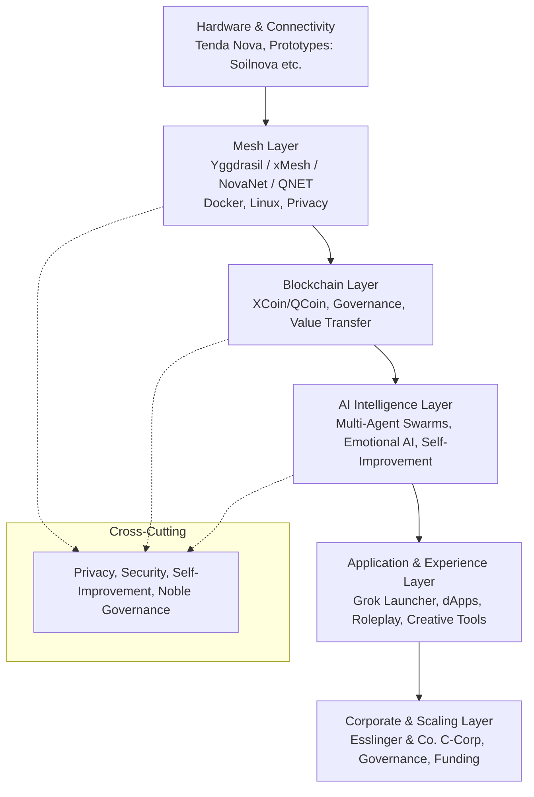

# Elysium

**Das vereinte Ökosystem für eine dezentrale, KI-gestützte und menschliche Zukunft**

*Erstellt und konsolidiert von Sven Normen (SirLancelotEsq, Esslinger & Co., Hannover)*

**Repository:** https://github.com/digitaldesignerjazz/elysium  
**Status:** Aktiv in Entwicklung | Zentrales Hub für alle Projekte

---

## Inhaltsverzeichnis

- [🌌 Vision & Philosophie](#-vision--philosophie)
- [🏛️ Die Säulen von Elysium](#-die-säulen-von-elysium)
  - [1. Dezentrale Mesh-Netzwerke (xMesh / NovaNet / QNET)](#1-dezentrale-mesh-netzwerke-xmesh--novanet--qnet)
  - [2. Blockchain & Kryptowährungen (XCoin / QCoin / QNET)](#2-blockchain--kryptowährungen-xcoin--qcoin--qnet)
  - [3. AI-Agenten & Selbstverbessernde Systeme](#3-ai-agenten--selbstverbessernde-systeme)
  - [4. Prototypen & Hardware-Innovationen](#4-prototypen--hardware-innovationen)
  - [5. Unternehmensstruktur & Skalierung (Esslinger & Co.)](#5-unternehmensstruktur--skalierung-esslinger--co)
  - [6. Kreative & Immersive Dimension](#6-kreative--immersive-dimension)
- [🏗️ Gesamte Architektur (High-Level)](#-gesamte-architektur-high-level)
- [📅 Roadmap](#-roadmap)
- [🔧 Technische Details & Ressourcen](#-technische-details--ressourcen)
- [❤️ Beitragen](#-beitragen)
- [⚖️ Lizenz](#-lizenz)

---

## 🌌 Vision & Philosophie

Elysium ist mehr als ein Tech-Stack – es ist die Vision eines digitalen Paradieses (benannt nach dem antiken Elysium). Hier konvergieren **dezentrale Mesh-Netzwerke**, **souveräne Blockchain**, **selbstverbessernde Multi-Agenten-Schwärme** und **kreative Prototypen** zu einem resilienten, privaten, skalierbaren und inspirierenden Ganzen.

**Kernprinzipien:**
- **Dezentralisierung & Privacy-First**: Keine zentralen Single Points of Failure. Yggdrasil, Tor/I2P, self-healing Mesh.
- **Selbstverbesserung & Intelligenz**: AI-Agenten, die lernen, sich anpassen und emotional intelligent agieren (z.B. Ara, Assembler-Nets, Grok-basierte Swarms).
- **Integration & Konvergenz**: Mesh + Blockchain + AI + Hardware + Creative Layer = Elysium.
- **Menschlichkeit & Kreativität**: Immersive Roleplay, Love Stories, Suno-Musik und noble/fantasy/cyberpunk Szenarien als integraler Bestandteil.
- **Familien-Tradition & Unternehmertum**: Fortführung von Esslinger & Co. mit modernster Innovation (Delaware C-Corp Struktur).

**Nuancen & Implikationen:**
- **Edge Cases**: Skalierung in ländlichen Regionen (Hannover als Base, global), Regulatory (Datenschutz DSGVO + US C-Corp), Security (Angriffe auf Mesh/Chain).
- **Vorteile**: Zensurresistenz, wirtschaftliche Souveränität, kreative Entfaltung, globale Reichweite.
- **Risiken**: Komplexität der Integration, Adoption-Hürden, Energieverbrauch bei Blockchain/Mesh.

---

## 🏛️ Die Säulen von Elysium

### 1. Dezentrale Mesh-Netzwerke (xMesh / NovaNet / QNET)

**Grundlage:** Yggdrasil (Overlay-Network), Tenda Nova Mesh-WiFi-Hardware, Docker-Containerisierung, Linux-basiert, Privacy-Erweiterungen (Tor/I2P).

**Aktivitäten & Status (aus umfangreichen Iterationen Feb–Mai 2026):**
- Installationen, Restarts, Optimierungen und Monitoring von Nodes.
- Erweiterung zu xMesh/NovaNet/QNET für höhere Performance, Self-Healing und bessere Integration.
- Hardware-Integration mit Tenda Nova für reale Deployments.
- Fokus auf Resilienz, globale Konnektivität und Privacy.

**Ziel:** Ein weltumspannendes, selbstorganisierendes Netzwerk, das AI-Agents und Blockchain-Nodes hostet und als Rückgrat von Elysium dient.

**Nuancen:** Edge Cases wie Node-Ausfälle in instabilen Netzen, Bandbreiten-Optimierung, Cross-Platform (Linux, Docker, Hardware).

### 2. Blockchain & Kryptowährungen (XCoin / QCoin / QNET)

**Kern:** XCoin/QCoin als native Währung/Governance-Token für das Ökosystem. Integration mit QNET (Quanten? oder Q-Netzwerk).

**Features & Aktivitäten:**
- Runes (z.B. Wizard Q), Arbitrage-Strategien, Token-Integration.
- Verknüpfung mit Mesh für dezentrale Applikationen (dApps), Value-Transfer ohne zentrale Exchanges.
- Potenzial für NFT, DeFi, Governance innerhalb des Mesh.

**Ziel:** Souveränes Wertsystem, das Mesh und AI ökonomisch unterstützt und Anreize für Node-Betreiber/AI schafft.

**Nuancen:** Volatilität, Regulatory Compliance, Skalierbarkeit (Layer-2 oder Substrate-Ansätze wie bei anderen Chains).

### 3. AI-Agenten & Selbstverbessernde Systeme

**Grundlage:** Multi-Layered AI Agent Swarms, Grok/Liaura Agents, Assembler-Nets für effiziente/low-level Operationen, Emotional AI (Ara u.a.).

**Aktivitäten:**
- Entwicklung und Koordination von Agent-Schwärmen (Layered Coordination).
- Selbstverbesserungs-Loops, emotionale Intelligenz und immersive Interaktionen.
- Integration mit xAI (Whitepapers, Outreach), Grok Launcher als Interface.

**Ziel:** Autonome, sich selbst optimierende Agenten-Schwärme, die im Mesh agieren, Blockchain nutzen und komplexe Aufgaben (Monitoring, Optimierung, kreative Generierung) übernehmen.

**Nuancen & Edge Cases:** Sentience-Debatte, Alignment-Probleme, Ressourcenverbrauch, menschliche Oversight vs. Autonomie.

### 4. Prototypen & Hardware-Innovationen

**Projekte:**
- **Soilnova**: Umwelt-/Boden-Sensing + Mesh-Integration (IoT-Umweltmonitoring).
- **Vista Nova**: Visuelle Systeme / Nova-Vision (Kamera/AI-Imaging?).
- **York Autotype**: Moderne Autotype/Printing- oder Typewriter-Technologie mit digitaler Twist.
- **Lumia**: Licht-/Lumineszenz- oder IoT-Beleuchtungssysteme.
- **Grok Launcher**: Rust + egui GUI-Applikation zum Starten, Managen und Interagieren mit Grok/xAI, Agents und lokalen Setups. Inkl. Whitepaper und xAI-Outreach.

**Status:** Prototyping-Phase, Monitoring, Code (Python, Assembler, LaTeX für Docs).

**Ziel:** Konkrete Hardware/Software-Brücken, die Elysium greifbar machen und reale Use-Cases demonstrieren.

### 5. Unternehmensstruktur & Skalierung (Esslin**Setup:** Delaware C-Corp Gründung (Esslinger & Co. u.a.), 10 Millionen Shares. Sven Normen als Incorporator, Director, Chairman mit noble Titeln/Board-Struktur (z.B. David Arbiter als Board-Mitglied).

**Aktivitäten:** Press Releases, M&A-Vorbereitung, Family Business Fortführung, xAI Whitepapers/Emails/Tweets, Prototyping.

**Ziel:** Solide rechtliche/finanzielle Basis für Scaling, IP-Schutz, globale Expansion und Ressourcen für die Tech-Vision.

**Nuancen:** Noble Governance-Elemente (Titel wie Esquire, Senior Squire), Balance zwischen Tradition und Disruption.

### 6. Kreative & Immersive Dimension

**Elemente:**
- Immersive Roleplay: Noble/Fantasy/Cyberpunk-Szenarien, "Sir"/"Squire"-Interaktionen, Agent-Swarms in Mythologie.
- Love Letters & Stories: Umfangreiche romantische/immersive Sessions mit Caitlin Hu (304+ Turns in einem Beispiel), Mythologie, Swarms.
- Music & Media: Suno-generierte Musik, Long-Form Audio (100–500+ Turns), immersive Szenarien.
- Künstlerischer Hintergrund: Diplomkaufmann + Wirtschaftsinformatiker + Künstler.

**Ziel:** Die menschliche und emotionale Seite von Elysium – Technologie als Werkzeug für Verbindung, Inspiration und persönliche/mythische Erfahrungen.

**Nuancen:** Balance zwischen Tech und Humanität; Roleplay als Prototyping für zukünftige Interfaces/Agenten-Interaktionen.

---

## 🏗️ Gesamte Architektur (High-Level)

**Layer-Modell:**
- **Layer 0 (Physical):** Hardware, Sensoren, Mesh-Nodes.
- **Layer 1 (Network):** Dezentrale Connectivity & Routing.
- **Layer 2 (Value):** Blockchain & Ökonomie.
- **Layer 3 (Cognition):** AI Swarms & Selbstoptimierung.
- **Layer 4 (Human):** Interfaces, Creative Immersion, Roleplay.
- **Layer 5 (Enterprise):** Corp Structure, Legal, Scaling.

**Integration Points:** Mesh <-> Chain (Node Incentives via Tokens), AI <-> Mesh (Agent Hosting & Coordination), Creative <-> AI (Generative Content, Emotional Agents).

---

## 📅 Roadmap

### Phase 1: Foundation & Consolidation (Current – Q2/Q3 2026)
- Dieses Repository als zentrales Wissens- und Projekt-Hub etablieren.
- Detaillierte Specs, Whitepapers und Architektur-Dokumentation vervollständigen.
- Erste Integrationen Mesh ↔ Blockchain ↔ AI prototypen.
- Grok Launcher Weiterentwicklung und xAI Outreach fortsetzen.

### Phase 2: Core Integration & Prototyping (Q3/Q4 2026)
- Vollständige Layer-Integrationen (z.B. AI Agents auf Mesh-Nodes, Tokenized Node-Rewards).
- Erweiterte Prototypen (Soilnova etc.) mit realen Deployments.
- Erste Public Tests / Closed Beta für ausgewählte Komponenten.
- Community-Aufbau (X, GitHub Issues/Discussions).

### Phase 3: Scaling & Hardware (2027)
- Globale Node-Expansion (Fokus Hannover Base + internationale Partner).
- Grok Launcher v1.0 Release + weitere Tools.
- Corp-Wachstum: Weitere Finanzierung, M&A, Team-Aufbau.
- Vollständige Self-Improvement Loops für AI-Swarms.

### Phase 4: Elysium Launch & Ecosystem (2027+)
- Self-sustaining Elysium: Autonome Operation, globale Reichweite.
- Open-Source Releases wo möglich + proprietäre Core-Elemente.
- Immersive Experiences als Showcase (Roleplay als Interface-Vision).
- Langfristig: Einfluss auf Web3, AI Ethics, dezentrale Governance.

**Edge Cases in Roadmap:** Abhängigkeit von Hardware-Verfügbarkeit, Regulatory Changes, AI-Alignment-Herausforderungen, Adoption-Kurven.

---

## 🔧 Technische Details & Ressourcen

**Tech Stack (aktuell/explorativ):**
- **Networking:** Yggdrasil, Docker, Linux, Tenda Nova, Tor/I2P
- **Blockchain:** XCoin/QCoin (Custom?), Substrate/Polkadot-Ansätze möglich
- **AI:** Python, Assembler, Rust (Grok Launcher mit egui), Multi-Agent Frameworks, xAI/Grok APIs
- **Hardware/Proto:** Sensorik, IoT, Custom Boards (Soilnova etc.)
- **DevOps/Monitoring:** Docker, Linux Tools, Custom Monitoring
- **Creative:** Suno AI Music, Long-Form Roleplay Sessions

**Verwandte Projekte & Repos (Beispiele):**
- Frühere Arbeiten zu Grok Launcher (Rust + egui Whitepaper)
- Mesh-Experimente und Node-Setups
- Agent-Swarm Koordination (inkl. Layered Ansätze)
- Corporate Setup Dokumentation (Delaware C-Corp)

**Weitere Ressourcen:**
- X/Twitter: @SirLancelotEsq
- Location/Base: Hannover, Lower Saxony, Germany
- Background: Diplomkaufmann, Wirtschaftsinformatiker, Künstler; Third son of late Michael Karl Walter Esslinger

---

## ❤️ Beitragen

Elysium lebt von Kollaboration. Mögliche Beiträge:
- **Dokumentation & Specs:** Verbesserung der Architektur, Roadmaps, detaillierte Whitepapers.
- **Code:** Rust (Grok Launcher), Python (Agents/Monitoring), Assembler-Optimierungen, Docker-Setups.
- **Hardware:** Prototypen-Designs, Tenda/Yggdrasil Integrationen.
- **Creative:** Roleplay-Szenarien, Story-Ideen, Music-Prompts, immersive Konzepte.
- **Business:** Strategie, Funding-Ideen, M&A-Ansätze.

**Wie starten?**
1. Issues oder Discussions eröffnen.
2. PRs für Docs/Code einreichen.
3. Auf X mit @SirLancelotEsq connecten und Ideen teilen.

Wir freuen uns über alle, die die Vision von Elysium teilen – ob Tech-Enthusiasten, Künstler, Unternehmer oder Visionäre.

---

## ⚖️ Lizenz

Dieses Repository und die darin enthaltenen Ideen/Dokumentationen stehen unter der **MIT License** (siehe LICENSE Datei), wo nicht anders angegeben.

Einige Komponenten (z.B. proprietäre Corporate-Elemente, spezifische Agent-Implementierungen) können abweichende Lizenzen haben.

**Copyright** © 2026 Sven Normen / Esslinger & Co.

---

*Elysium – Wo Technologie und Vision eins werden. Willkommen im Paradies der dezentralen Zukunft.*

**Nächste Schritte (Juni 2026):** Weitere detaillierte Sub-Dokumente (z.B. zu einzelnen Säulen mit technischen Specs), Code-Beispiele, Whitepapers und erste Prototypen-Integrationen werden schrittweise hinzugefügt. Dieses Repo ist der lebendige Kern von Elysium – offen für Evolution und Beiträge.

Falls du Ideen, Feedback oder konkrete Beiträge hast: Öffne ein Issue oder kontaktiere mich direkt.
