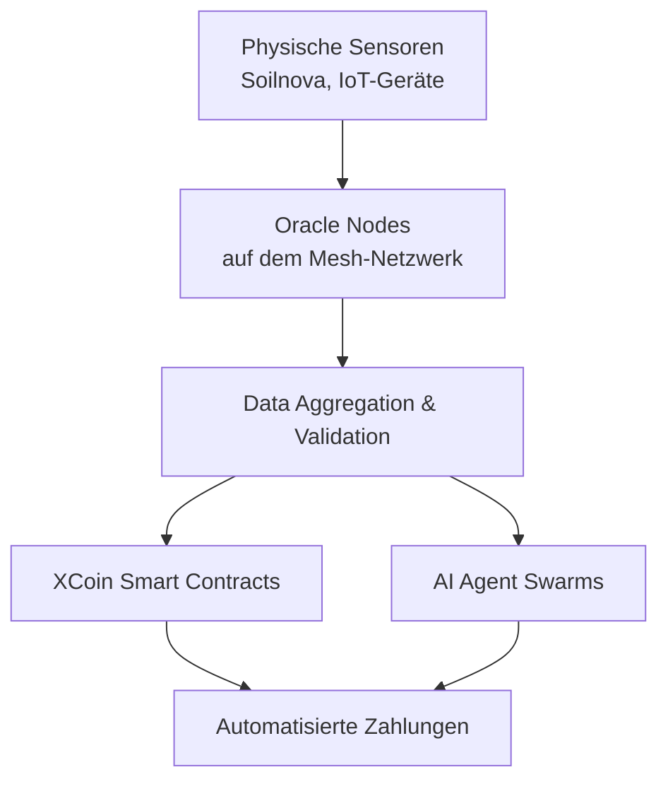

# Decentralized Oracle Networks in Elysium

**Bringing Real-World Data On-Chain**

---

## 1. Warum brauchst Elysium Oracles?

Viele der ambitioniertesten Use-Cases in Elysium benötigen **zuverlässige Echtzeit- oder historische Daten aus der realen Welt**:

- **Soilnova**: Bodenfeuchte, Temperatur, pH-Wert, Nährstoffe
- **Umwelt- und Klimadaten** für AI-gestützte Entscheidungen
- **Preisdaten** für Token/Arbitrage-Strategien
- **IoT-Sensordaten** von Prototypen (Lumia, Vista Nova etc.)

Ohne vertrauenswürdige Oracles können Smart Contracts und autonome Agents keine fundierten Entscheidungen auf Basis realer Bedingungen treffen.

---

## 2. Rolle von Decentralized Oracle Networks in Elysium

Ein dezentrales Oracle-Netzwerk soll folgende Aufgaben übernehmen:

- Sammeln von Daten von physischen Sensoren (Soilnova etc.)
- Validierung und Aggregierung der Daten (durch mehrere unabhängige Nodes)
- Bereitstellung der Daten für XCoin Smart Contracts und AI-Agents
- Hohe Verfügbarkeit und Manipulationsresistenz

**Vorteil gegenüber zentralen Oracles:**
- Kein Single Point of Failure
- Höhere Vertrauenswürdigkeit durch Konsens
- Bessere Integration in das dezentrale Mesh-Netzwerk

---

## 3. Architektur-Vorschlag für Elysium

**Schichten:**
- **Layer 0 (Hardware)**: Soilnova & andere Sensoren
- **Layer 1 (Mesh)**: Oracle Nodes laufen auf dem dezentralen Netzwerk
- **Layer 2 (XCoin)**: Smart Contracts nutzen die Daten
- **Layer 3 (AI)**: Agents treffen Entscheidungen basierend auf Oracle-Daten

---

## 4. Integration mit XCoin & Agent Payments

Decentralized Oracles ermöglichen fortschrittliche Zahlungslogik:

- **Conditional Payments**: "Zahle nur, wenn die Bodenfeuchte unter 20% liegt"
- **Quality-based Payments**: Wie im aktuellen Smart Contract Stub (Qualitätsscore)
- **Automated Service Level Agreements** zwischen Agents
- **Real-time Data Triggers** für autonome Agent-Aktionen

Beispiel:
> Wenn der Oracle einen Qualitäts-Score von > 85 meldet → führe automatische Zahlung aus.

---

## 5. Mögliche Implementierungsansätze

| Ansatz                    | Vorteile                              | Herausforderungen                  | Empfehlung für Elysium |
|---------------------------|---------------------------------------|------------------------------------|---------------------------|
| Chainlink-Style           | Sehr ausgereift                       | Zentrale Komponenten               | Mittel                    |
| Eigenes dezentrales Netzwerk | Volle Kontrolle, Mesh-nativ         | Hoher Entwicklungsaufwand          | **Empfohlen**             |
| Hybrid (bestehende + eigene Nodes) | Schneller Start                     | Komplexität                     | Praktikabel               |

---

## 6. Roadmap & Nächste Schritte

**Phase 1 (Q3/Q4 2026)**
- Konzeption eines minimalen Oracle-Node-Prototyps
- Integration von Soilnova-Daten als erste Oracle-Quelle
- Erweiterung der Smart Contract Logik um Oracle-Daten

**Phase 2 (2027)**
- Aufbau eines kleinen dezentralen Oracle-Netzwerks auf dem Mesh
- Agenten, die aktiv Oracle-Daten abfragen und Zahlungen triggern
- Erste produktive Use-Cases (z. B. automatische Bewässerungs- oder Umweltentscheidungen)

---

## 7. Verbindung zu bestehenden Elysium-Komponenten

- **Soilnova** → Primäre Datenquelle für Oracles
- **XCoin Smart Contracts** → Nutzen Oracle-Daten für bedingte Zahlungen
- **AI Agent Swarms** → Treffen datenbasierte Entscheidungen
- **Mesh-Netzwerk** → Hosting der Oracle Nodes
- **Grok Launcher** → Mögliche UI zur Visualisierung von Oracle-Daten

---

*Dieses Dokument ist Teil des lebendigen Elysium-Repos und wird kontinuierlich erweitert.*

**Verwandte Dokumente:**
- `blockchain-xcoin-deep-dive.md`
- `ai-agent-swarms.md`