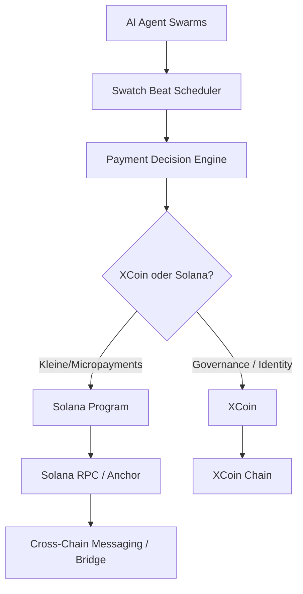

# Solana-Netzwerk-Integration – Planung & Technische Roadmap

**Integration von Solana in das Elysium-Ökosystem**

---

## 1. Ziel der Integration

Die Integration von **Solana** in Elysium verfolgt folgende Hauptziele:

- Nutzung der hohen Transaktionsgeschwindigkeit und niedrigen Fees von Solana
- Erweiterung der Zahlungsinfrastruktur (vor allem für Micropayments und Agent-to-Agent Payments)
- Zugang zum etablierten Solana-Ökosystem (DeFi, NFTs, Programme)
- Möglichkeit, AI-Agents direkt mit On-Chain-Programmen interagieren zu lassen
- Ergänzung zu XCoin (nicht Ersatz)

**Langfristige Vision:**
Elysium nutzt ein **Multi-Chain-Design**, bei dem XCoin als Governance- und Identity-Layer dient, während Solana als Hochleistungs-Layer für schnelle und günstige Transaktionen fungiert.

---

## 2. Mögliche Integrationsansätze

| Ansatz                        | Beschreibung                                                                 | Vorteile                                      | Nachteile / Risiken                        | Empfehlung     |
|-------------------------------|------------------------------------------------------------------------------|-----------------------------------------------|--------------------------------------------|----------------|
| **Bridge-basiert**            | Wrapped XCoin oder Assets zwischen XCoin und Solana                          | Relativ einfacher Einstieg                    | Bridge-Sicherheit, zentrale Komponenten    | Mittel         |
| **Native Solana-Programme**   | AI-Agents interagieren direkt mit Solana Smart Contracts                     | Hohe Performance, native Solana-Features      | Höhere Komplexität                     | **Empfohlen**  |
| **Hybrid (XCoin + Solana)**   | XCoin für Governance + Identity, Solana für schnelle Payments        | Beste Balance aus Kontrolle und Performance   | Erhöhte Systemkomplexität               | Sehr empfohlen |
| **Solana als Data Layer**     | Oracles und Agent-Daten werden auf Solana gespeichert                        | Gute Skalierbarkeit                           | Weniger Fokus auf Payments                 | Mittel         |

**Empfohlene Strategie:**
**Hybrid-Ansatz** mit Fokus auf native Solana-Programme für Agent-Payments und Micropayments.

---

## 3. Technische Architektur (Vorschlag)

**Komponenten:**
- **Payment Decision Engine**: Entscheidet, ob eine Transaktion auf XCoin oder Solana ausgeführt wird
- **Solana Program**: Spezielles Programm für schnelle Agent-Payments
- **Swatch Beat Scheduler**: Plant Zahlungen zeitbasiert
- **Conditional Logic**: Smart Contract-ähnliche Bedingungen vor der Zahlung

---

## 4. Technische Roadmap

### Phase 1: Foundation (Q3 2026)
- Research zu Solana (Anchor Framework, SPL Tokens, CPI)
- Erstellung eines minimalen Solana-Programms (z. B. einfacher Payment Escrow)
- Aufbau einer Test-Umgebung (Solana Devnet + lokale Validatoren)
- Erste Dokumentation der Integrationsarchitektur

### Phase 2: Prototyping (Q4 2026 – Q1 2027)
- Entwicklung eines **Solana Payment Program** für Agent-to-Agent Payments
- Integration des Swatch Beat Schedulers mit Solana-Transaktionen
- Erste bedingte Zahlungen (Conditional Payments auf Solana)
- Cross-Chain Messaging Prototyp (z. B. via Wormhole oder LayerZero)

### Phase 3: Erweiterung (Q2 2027)
- Vollständige Integration in den Grok Launcher (Wallet + Solana-Transaktionen)
- AI-Agents, die autonom mit Solana-Programmen interagieren
- Oracle-Integration: Decentralized Oracles schreiben Daten auf Solana
- Performance-Optimierung und Security-Audits

### Phase 4: Produktion & Skalierung (ab Q3 2027)
- Mainnet-Deployment relevanter Solana-Programme
- Produktionsreife Bridge / Cross-Chain Messaging
- Erweiterung der Multi-Chain-Strategie (weitere Chains bei Bedarf)
- Governance-Mechanismen für Cross-Chain-Operationen

---

## 5. Technische Entscheidungspunkte

| Thema                        | Optionen                                      | Empfehlung          |
|------------------------------|-----------------------------------------------|---------------------|
| Framework                    | Anchor vs. Native Rust                        | **Anchor**          |
| Cross-Chain Messaging        | Wormhole, LayerZero, Eigenbau                 | Wormhole / LayerZero|
| Token Standard               | SPL Token vs. Custom Program                  | SPL Token           |
| Payment Logic                | On-Chain vs. Off-Chain Decision + On-Chain Execution | Hybrid         |
| Agent-Interaktion            | Direct CPI vs. Relayer                        | Direct CPI          |

---

## 6. Nächste Schritte (empfohlen)

1. Erstellung eines detaillierten technischen Designs für das Solana Payment Program
2. Aufbau einer lokalen Solana-Entwicklungsumgebung
3. Erster Prototyp: Einfacher Agent-Payment auf Solana Devnet
4. Integration mit bestehendem Swatch Beat Scheduler
5. Entscheidung über Cross-Chain Messaging Technologie

---

*Dieses Dokument ist Teil des lebendigen Elysium-Repos und wird kontinuierlich erweitert.*

**Verwandte Dokumente:**
- `blockchain-xcoin-deep-dive.md`
- `decentralized-oracles.md`
- `corporate-structure.md`